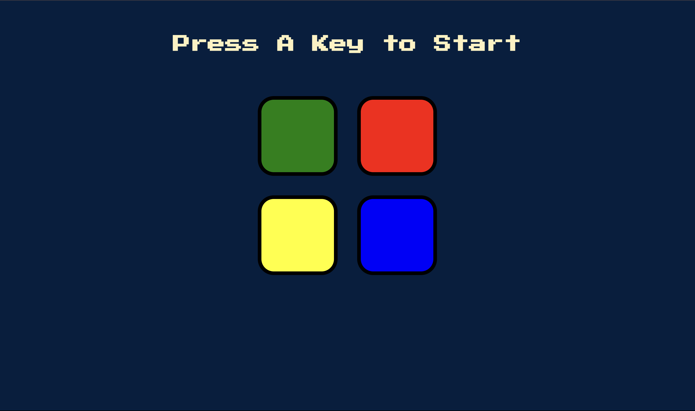

# The-Simon-Game

A simple implementation of the Simon game in JavaScript.

## How to Play

The Simon game is a memory game where players need to repeat a sequence of colors and sounds that are played by the game. The sequence gets longer and more challenging as the game progresses. The objective is to see how far you can go without making a mistake.

The game consists of four colored buttons: red, green, blue, and yellow. Each button produces a unique sound when clicked.

To play the game:

1. Press the "Start" button to begin the game.
2. Watch and listen to the sequence of colors and sounds played by the game.
3. Repeat the sequence by clicking the buttons in the correct order.
4. If you make a mistake, the game will end, and you can start over.

## Technologies Used

- HTML
- CSS
- JavaScript
- jQuery

## Demo

You can play the Simon game online by visiting the [Simon Game Demo](https://example.com/simon-game-demo).

## Installation

To run the game locally, follow these steps:

1. Clone the repository: `git clone https://github.com/Ambitama01/simon-game.git`
2. Navigate to the project directory: `cd simon-game`
3. Open the `index.html` file in your web browser.

## Contributing

Contributions are welcome! If you have any suggestions, bug reports, or feature requests, please open an issue on the [GitHub repository](https://github.com/your-username/simon-game).

## License

This project is licensed under the [MIT License](LICENSE).
